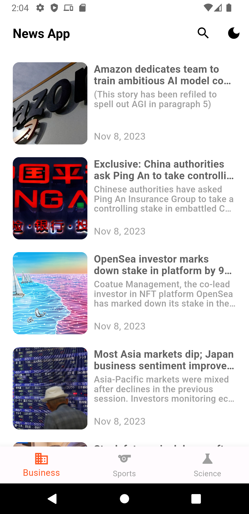
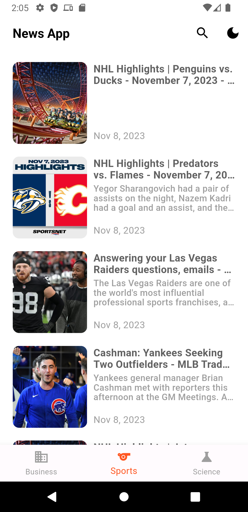
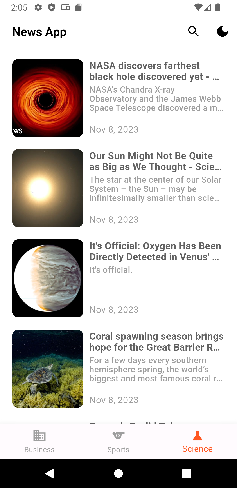
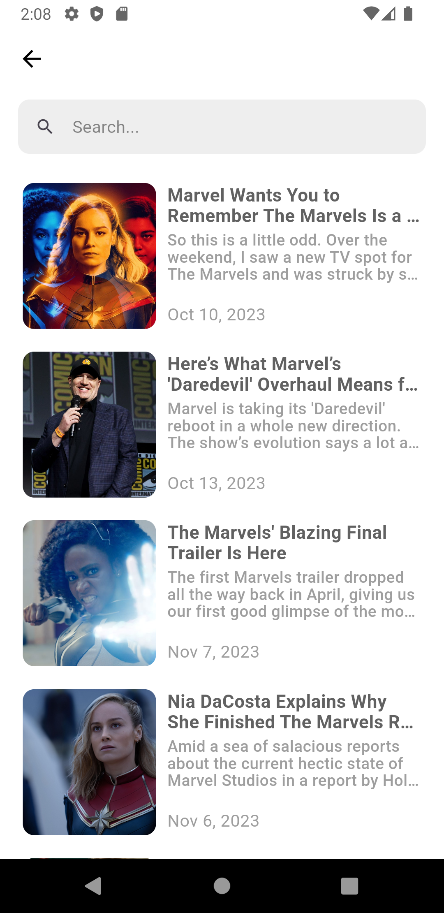
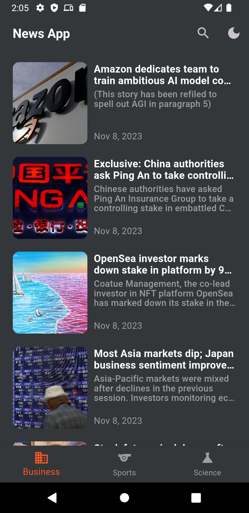
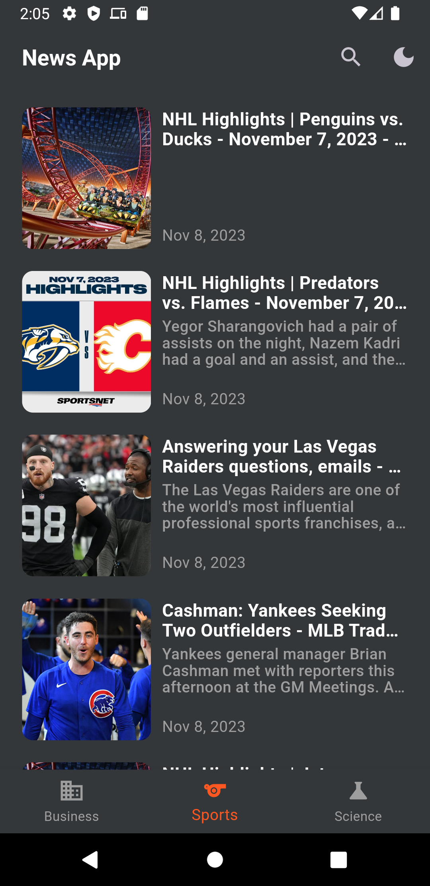
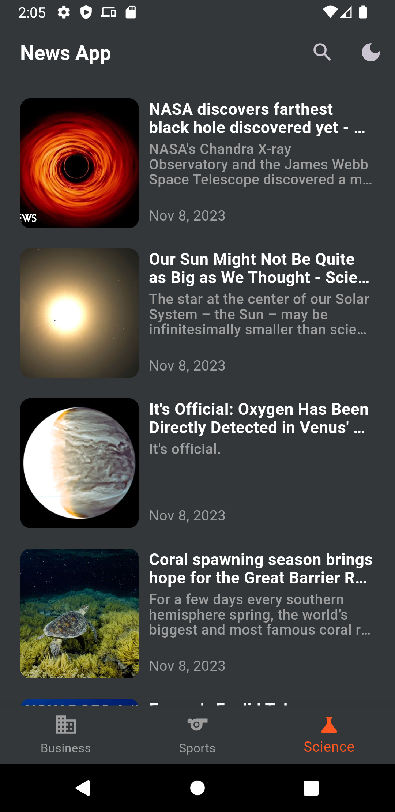
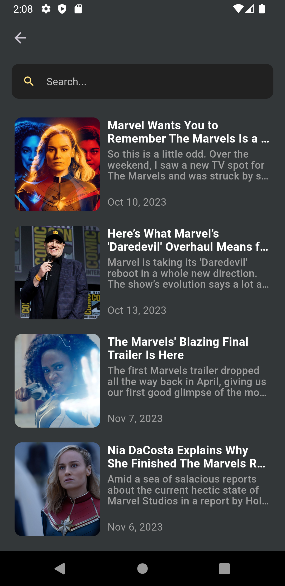

# News App

This is a News App that allows users to access a variety of news articles from different categories, such as business, sports, science, and more. It provides an easy-to-use interface to view the latest headlines and search for news articles based on specific keywords. The app is built using Flutter and utilizes various libraries like Dio, Intl, WebView, and others to provide a seamless news reading experience.
## Screenshots

Here are some screenshots of the news app:
| Business  | Sports | Sciences | Search |
| ----------- | ----------- | ----------- | ----------- |
|||||

| Business  | Sports | Sciences | Search |
| ----------- | ----------- | ----------- | ----------- |
|||||

## Features

- Browse news articles from multiple categories.
- Search for news articles using keywords.
- View the details of a news article, including the headline, publication date, source, and article content.
- Save your favorite articles for future reference.
- Share articles with friends and family.
- A user-friendly and responsive design for an enhanced user experience.

## Packages Used:

The following packages are used in this project:

| Library         | Description                                                   |
|-----------------|---------------------------------------------------------------|
| Flutter         | Framework for building natively compiled applications for mobile, web, and desktop. |
| Dio             | HTTP client for making network requests. |
| Intl            | Library for internationalization and localization. |
| WebView         | Widget for displaying web content within the app. |

## Contribution

Contributions to the project are welcome! If you'd like to contribute, please fork the repository and make changes as you'd like. Pull requests are warmly welcome.

## License

Maktabty is released under the MIT License. See the [LICENSE](LICENSE) file for more details.

####  Follow me :

  
  
   

## Watch the Demo

Check out the demo video by clicking the link below:

Alternatively, you can download the video directly:

- [Download Demo Video](assets/videos/multiKate.mp4)